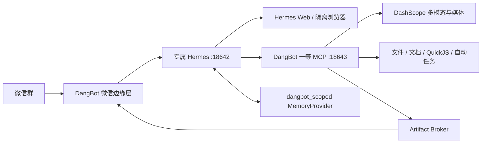

# DangBot

DangBot 是一个面向微信群的 Hermes Agent。Wechaty/wechat4u 只负责微信群收发；Node 侧保留身份与权限、限流、任务队列、附件、审批、产物投递和可靠定时唤醒。所有普通对话、意图理解、规划、多步骤工具选择、失败重规划与最终回答都由一套独立的 Hermes Agent 完成，没有旧 Agent 后端和运行时回退开关。



## 固定模型与边界

- 主 Agent：`deepseek-v4-flash`，只在专属 Hermes 中负责对话、规划和工具编排。
- 图片/视频理解：`qwen3.7-flash`。
- 图片生成：`qwen-image-3.0-pro`，最多 3 张显式参考图。
- TTS：`qwen-audio-3.0-tts-flash`。
- 视频：按输入严格路由 `happyhorse-1.1-t2v`、`happyhorse-1.1-i2v`、`happyhorse-1.1-r2v` 或 `happyhorse-1.0-video-edit`。
- Web 使用 Hermes 的原生 `web_search` 工具和固定 DDGS 后端，页面交互使用临时未登录浏览器。宿主终端、任意文件读写、Computer Use、消息代发、插件/技能安装、Home Assistant、Hermes Cron、子 Agent 和交互式 clarify 工具均关闭。
- 代码只在 QuickJS-WASM 中执行纯 JavaScript；没有 Shell、网络、宿主文件系统、`process`、`require` 或模块加载。项目不依赖 Docker。

Hermes 0.19.0 没有原生 DashScope 图片、HappyHorse 视频和 Qwen Audio TTS 插件，因此这些能力通过 loopback MCP 调用。MCP 只提供严格 Schema 的一等工具，不存在 `dangbot_execute_tool` 之类的通用入口。返回值固定为 `{status, summary, artifactIds, data}`，模型看不到宿主绝对路径。

## 初始化

要求 Node.js 20+、pnpm，以及独立 Python 3.11–3.13。专属运行时固定在被 Git 忽略的 `.runtime/hermes/`，不会读取或复制 `~/.hermes`。

```bash
pnpm install
cp config/local.yaml.example config/local.yaml

# 创建固定 hermes-agent==0.19.0、ddgs==9.14.4 的独立 venv、配置和插件
pnpm hermes:bootstrap:browser

# 无回显写入 DangBot 专用 DeepSeek / DashScope 凭据，并生成 API、MCP、
# Memory Bridge 与 session 独立密钥
pnpm hermes:configure

# 离线真实 Hermes + 模拟 DeepSeek，不连接微信或供应商
pnpm hermes:preflight:offline

# 启动专属 Hermes；另一个终端启动 DangBot
pnpm hermes:run
pnpm build
pnpm start
```

macOS 可用 `pnpm hermes:install:launchd` 安装标签为 `com.sy2rk.dangbot-hermes` 的专属服务。其他平台直接用各自服务管理器运行 `scripts/hermes/run-dedicated.mjs`。完整流程见 [专属 Hermes 运维手册](docs/hermes-backend.md)。

DangBot 启动前会把 API 返回的 PID 与项目 `.runtime/hermes/home/gateway.pid` 核对，再检查专属 Hermes readiness、`deepseek-v4-flash` 模型声明、完整安全工具面、MCP、Memory Bridge 和 DashScope 媒体凭据；PID 或任一关键依赖不匹配就直接失败，不会连接微信、误操作其他 Hermes 或回退到旧 Agent。进程重启后会先撤销旧 capability、终止专属 Hermes 孤儿 run，并把中断任务明确标记失败；不会把失联任务留在处理中。

## 微信入口

普通群消息只进入有上限、24 小时有效的群公开窗口；只有 @ 机器人后才会创建 Agent 任务。除少量必须在边缘执行的管理命令外，原始请求不会预分类，也不会被 Node 指定工具。

- `@DangBot 状态`、`@DangBot 自检`
- `@DangBot 清空上下文`：增加个人 session epoch，下一次使用全新 Hermes 会话。
- `@DangBot 记住：...`：本人直接保存当前群内的个人记忆。
- `@DangBot 全局记住：...`：管理员直接保存当前群共享记忆，不跨群。
- `@DangBot 我的记忆`、`@DangBot 全局记忆`：列表会显示可用于精确删除的记忆 ID。
- `@DangBot 忘记 mem_...`：只删除本人在当前群的指定个人记忆。
- `@DangBot 清空我的记忆`、`@DangBot 清空全局记忆`
- `@DangBot 自动化列表`、`暂停第1个`、`恢复第1个`、`删除第1个`
- `@DangBot 取消` 或 `取消 task_...`
- `@DangBot 同意` / `拒绝`：只处理当前 Hermes 审批点，只有 allow-once 或 deny。
- `@DangBot 同意 proposal_...` / `拒绝 proposal_...`：按个人、群或系统管理员作用域审批记忆提案。
- `@DangBot 记忆提案`：只列出当前身份有权审批的 pending 提案。
- `@DangBot Agent 经验`、`@DangBot 撤销 Agent 经验 lesson_...`：仅系统管理员查看和撤销已批准的跨群经验。

自然语言提醒、自动任务、复合文件处理、搜索、浏览器、媒体和文档请求都直接进入 Hermes。例如“搜索今天的资料，分析刚才的 PDF，再整理成 DOCX”允许 Hermes 连续调用多项独立工具，并在结构化错误后重新规划。可能产生费用但语义不清的请求会先返回普通澄清问题。

## 附件与产物

- 可输入 TXT、MD、CSV、DOCX、PDF、XLSX、PNG/JPEG/WEBP 和常见 MP4/MOV/WEBM 视频。
- 当前消息附件和同群同用户最近最多 5 个仍有效附件会以逻辑 ID 和安全元数据交给 Hermes；Hermes 必须显式选择 ID。
- 文本抽取按 `attachmentId + cursor + maxChars` 确定性分页，不调用其他文字模型。
- 文档渲染只接收 Hermes 已组织好的标题与正文，确定性生成 DOCX/TXT/MD。
- 每次使用附件前会重新核对上传根目录、内容类型、MIME、大小和 SHA-256；Artifact Broker 对产物再做同类校验。Wechaty 最终发送真实 `FileBox`，不会用路径文字冒充附件。
- 图片生成按供应商限制全局每分钟 1 次，视频生成全局并发 1，Hermes run 并发 2。取消任务会停止 Hermes run、DashScope 异步任务和 QuickJS，并立即撤销 capability。

Qwen Image 3.0 Pro 需要供应商账号权限。如果供应商返回 403，DangBot 会保留准确的不可用错误；在账号权限开通并完成真实验收前，不应对外宣称图片生成可用。

## 作用域记忆与反思

每个“群 + 用户 + session epoch”拥有独立、不可逆生成的 Hermes 会话。官方 `dangbot_scoped` MemoryProvider 只预取当前用户在当前群的个人记忆、当前群共享记忆和系统管理员批准的 Agent 经验。Hermes 共享 `MEMORY.md/USER.md` 与技能自动写入关闭。

反思由信号触发并批量执行：累计 5 个候选或空闲 15 分钟触发，每批最多 8 个任务，同一会话至少间隔 30 分钟。它复用同一个 Hermes/DeepSeek，但使用独立 reflection session 和 capability，只能调用作用域记忆工具，也不会向微信群回复。

个人记忆仅在置信度不低于 0.95、证据是足够长度的当前用户原话、内容被证据直接支持、无冲突、非敏感、非临时状态且每批最多一条时自动保存；其余交本人审批。群记忆始终由群管理员审批，跨群 Agent 经验始终由系统管理员审批并可撤销。反思执行临时失败时，候选会安全释放并等待后续批次重试，不会静默丢失。自动保存会在该用户下一次交互时透明提示。

首次迁移只保留 `source=manual` 的个人/本群记忆；旧自动摘要和 `room_id='*'` 数据会删除。

## 验证

```bash
pnpm typecheck
pnpm lint
pnpm test
pnpm build
git diff --check
pnpm audit --prod
pnpm hermes:preflight:offline
pnpm hermes:preflight:live       # 专属 Hermes + DeepSeek，不连接微信
pnpm dashscope:preflight         # 多模态与 TTS；付费媒体需显式参数
```

`pnpm dashscope:preflight -- --image`、`--video` 或 `--paid-media` 会创建真实付费任务，只应由运维人员显式执行。真实微信群验收清单见 [手工验收](docs/manual-acceptance.md)。

发布前后必须只读核对现有 `ai.hermes.gateway` 的 PID、launchd 状态、配置哈希和会话目录；不得停止、重启、替换或读取它的凭据。回滚通过恢复上一稳定 Git SHA 和数据库/配置快照完成，只重启 DangBot，不存在运行时旧后端开关。
