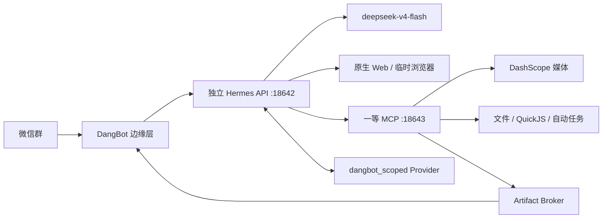

# DangBot 专属 Hermes 运维手册

## 不变量

- `ai.hermes.gateway` 不属于 DangBot。不得停止、重启、更新、替换或切换它的 profile；不得读取、复制或散列以外处理 `~/.hermes` 中的凭据和会话内容。
- DangBot 专属实例固定使用项目 `.runtime/hermes/`、API `127.0.0.1:18642`、MCP/Memory Bridge `127.0.0.1:18643` 和 launchd 标签 `com.sy2rk.dangbot-hermes`。
- 微信群只经 Wechaty/wechat4u 接入，不启用 Hermes 微信适配器。
- Hermes 是唯一 Agent。Hermes、MCP、Memory Bridge 或 DashScope 关键配置未就绪时 DangBot 启动失败，不存在旧后端回退。
- 回滚只能恢复上一稳定 Git SHA 与数据库/配置快照，然后只重启 DangBot。

## 运行组件



`hermes-agent==0.19.0` 和无密钥搜索后端 `ddgs==9.14.4` 固定在专属 venv。配置同时关闭宿主 terminal/file/code execution、共享 memory、skills、delegation、cron、Computer Use、Home Assistant 和原生媒体生成；只保留 Hermes 的 `web_search`、临时 browser、专属 MCP 与 `dangbot_scoped` MemoryProvider。

Hermes 0.19.0 要暴露外部 Provider 工具就必须连同共享 `memory` toolset 一起启用。为避免暴露全局 `MEMORY.md` 写入口，Provider 只承担 prefetch/sync turn；严格的 `dangbot_memory_recall/propose/feedback` 作为同一 loopback MCP 的一等工具注册。作用域与落库规则仍由 Memory Bridge 和 session-key 哈希映射强制执行。

## 首次初始化

1. 只读记录非 DangBot Hermes 基线：

   ```bash
   launchctl print "gui/$(id -u)/ai.hermes.gateway"
   ps -axo pid=,command= | grep '[h]ermes_cli.main'
   shasum -a 256 "$HOME/.hermes/config.yaml"
   find "$HOME/.hermes/sessions" -mindepth 1 -maxdepth 1 -type d | wc -l
   ```

   只记录 PID、状态、配置哈希和会话目录数量/名称，不打开凭据内容。

2. 创建独立运行时：

   ```bash
   pnpm hermes:bootstrap:browser
   ```

   脚本创建 `.runtime/hermes/venv` 和 `.runtime/hermes/home`，安装固定版本并复制跟踪配置及两个插件：`dangbot_scoped` 与 `dangbot_guard`。它不执行任何 `hermes profile use/clone/update`。浏览器只复用可执行文件，profile、Cookie 和会话始终临时未登录；需要独立浏览器二进制时运行 `pnpm hermes:bootstrap:browser-download`。

3. 配置专用凭据：

   ```bash
   pnpm hermes:configure
   ```

   脚本用无回显输入接收 DangBot 专用 DeepSeek 与中国（北京）DashScope key，为 Hermes API、MCP、Memory Bridge 和 session HMAC 分别生成随机密钥，将本地文件写为 `0600`，并在 `.runtime/hermes/backups/` 留备份。无人值守可临时设置 `DANGBOT_DEEPSEEK_API_KEY` 与 `DANGBOT_DASHSCOPE_API_KEY`；不得写入 shell profile 或版本库。

4. 运行离线预检：

   ```bash
   pnpm hermes:preflight:offline
   ```

   预检复用专属 venv，但创建一次性临时 `HERMES_HOME`、随机 loopback 端口和模拟 DeepSeek，不读取正式专属会话，也不连接微信或供应商。它会：

   - 用 Python Hermes 同版本 MCP 客户端验证 17 个严格工具；
   - 启动真实 Hermes 0.19.0 API，验证 `/v1/runs`、SSE 和 `deepseek-v4-flash`；
   - 确认全部一等 MCP/记忆工具存在，通用执行入口和宿主工具不存在；
   - 在退出时销毁临时 HOME。

5. 启动专属 Hermes：

   ```bash
   pnpm hermes:run
   # macOS 可选：
   pnpm hermes:install:launchd
   ```

   启动器仅使用 `--force` 绕过 Hermes 对“机器上已有任意网关”的宽泛守卫，绝不使用会替换进程的 `--replace`。它显式把 loopback 加入 `NO_PROXY/no_proxy`，避免本机代理把 MCP 请求送出主机。

6. 在不连接微信的情况下执行真实供应商预检：

   ```bash
   pnpm hermes:preflight:live
   pnpm dashscope:preflight
   ```

   第一项只验证专属 Hermes + DeepSeek，第二项默认验证 `qwen3.7-flash` 和 Qwen Audio TTS。图片/视频会产生费用，必须显式追加 `-- --image`、`--video` 或 `--paid-media`。Qwen Image 返回 403 时记录为供应商权限未开通，禁止宣称可用。

## 数据迁移

启动新构建时数据库迁移会：

- 创建 `hermes_sessions`、`hermes_session_epochs`、`memory_proposals`、`agent_lessons`、`reflection_batches`、`reflection_candidates`；
- 把任务语义收敛为 `origin=interactive|automation|reflection`；
- 物理删除旧 tasks/automations 的 `request_type/tool_name/tool_input_json` 路由列与旧 Node `contexts` 表；
- 只保留 `source=manual` 且不属于 `room_id='*'` 的记忆；旧 `global` 记录仅在其原群内转为 room scope；
- 把旧 `scheduled_tool` 自动任务标记迁移为 `scheduled_prompt`。

切换前必须对 `data/` 与 `config/local.yaml` 做受控快照，并记录上一稳定 Git SHA。

## 发布

1. 跑完整自动门禁和离线预检。
2. 启动并检查专属 Hermes；确认 API/MCP 只监听 loopback，并发分别为 2/视频 1。
3. 只停止 DangBot，备份数据后启动新构建。启动检查通过后才连接 WeChat。
4. 在真实测试群完成 [手工验收](manual-acceptance.md)，再一次性承接所有已授权群流量；不做双写，不导入普通聊天上下文。
5. 发布后重新采集 `ai.hermes.gateway` 基线，四项必须与发布前完全一致。

## 回滚

发生阻断故障时：

1. 停止 DangBot；
2. 恢复上一稳定 Git SHA、数据库和本地配置快照；
3. 只启动 DangBot；
4. 再次确认 `ai.hermes.gateway` 基线未变。

不得把配置改成旧 backend，也不得停止或修改任何 Hermes 服务来“清场”。

## 日志与排障

- 用 `taskId/runId` 关联状态、延迟、失败、工具名、审批、沙箱拒绝、模型用量和 artifact 投递。日志不得包含密钥、原始 capability、完整提示词、原始 session key 或宿主路径。
- SSE 断开后自动查询 run 状态。取消任务会调用 `/stop`、终止任务内工具并撤销 capability。
- MCP 连接出现 502 时先检查 `NO_PROXY/no_proxy` 是否含 `127.0.0.1,localhost,::1`，不要把 loopback 流量交给 HTTP 代理。
- 浏览器不可用时重新运行 bootstrap browser，不得指向用户 Chrome profile。
- 专属日志位于 `.runtime/hermes/home/logs/`；DangBot 日志由 `logging.file` 控制。
