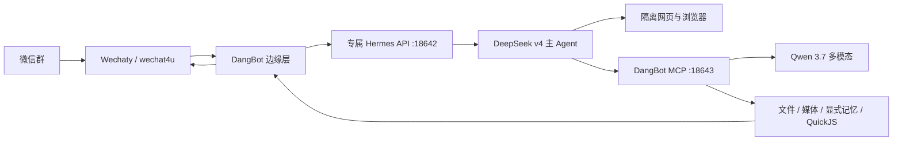

# DangBot 专属 Hermes 运维手册

## 不变量

- 现有 `ai.hermes.gateway` 不属于 DangBot：不得停止、重启、更新、替换、切换 profile，也不得复制 `~/.hermes` 的配置、凭据、会话或浏览器状态。
- 专属实例固定使用项目 `.runtime/hermes/`、`127.0.0.1:18642`、`127.0.0.1:18643` 和 `com.sy2rk.dangbot-hermes`。
- 微信群始终由 Wechaty/wechat4u 接入。Hermes 自带微信适配器不启用。
- 正式切换前保持 `agent.backend=legacy`；失败时绝不自动回退到不受控工具。

## 架构



DangBot 保存 `hermes_runs`、`mcp_contexts` 和 `artifacts` 映射。Hermes 看不到宿主绝对路径；Wechaty 只发送 artifact broker 重新校验过的文件。

## 初始化

1. 确认独立 Python 3.11 可用，然后运行：

   ```bash
   pnpm hermes:bootstrap:browser
   ```

   脚本只创建 `.runtime/hermes/venv` 和 `.runtime/hermes/home`，并安装固定 `hermes-agent==0.19.0`。不调用 `hermes profile use/clone/update`。浏览器默认只复用已安装浏览器的可执行程序，但强制使用 agent-browser 的临时未登录 profile；不会读取该浏览器的用户目录或 Cookie。需要连浏览器二进制也独立时，运行 `pnpm hermes:bootstrap:browser-download`。启动器只用 `--force` 绕过 Hermes 对“机器上已有任意 launchd 网关”的宽泛前台保护；绝不使用会停止其他进程的 `--replace`。

2. 运行 `pnpm hermes:configure -- --backend legacy`，以无回显方式输入 DangBot 专用的 DeepSeek key。脚本会保留现有 OpenRouter/Qwen 配置，为专属 API、MCP 和会话分别生成随机密钥，把运行凭据写入权限为 `0600` 的忽略文件，并在 `.runtime/hermes/backups/` 留下本地配置备份。不要复用或复制 `~/.hermes/.env`。也可由无人值守部署通过临时环境变量 `DANGBOT_DEEPSEEK_API_KEY` 输入；不要把该变量写入 shell profile。

3. 给 DangBot 进程设置：
   - `DANGBOT_MCP_API_KEY`：与专属 Hermes 的同名值一致。
   - `DANGBOT_HERMES_API_KEY`：与专属 Hermes 的 `API_SERVER_KEY` 一致。
   - `DANGBOT_HERMES_SESSION_SECRET`：另一个独立随机值，只用于不可逆生成“群 + 用户”的会话身份。
   - `DANGBOT_AGENT_BACKEND=legacy`：预验收阶段必须保持 legacy。

## 离线预验收

1. 记录现有 Hermes 基线，输出保存到发布工单，不要修改服务：

   ```bash
   launchctl print "gui/$(id -u)/ai.hermes.gateway"
   shasum -a 256 "$HOME/Library/LaunchAgents/ai.hermes.gateway.plist"
   ps -axo pid=,command= | grep '[h]ermes_cli.main'
   ```

   同时只读记录现有 Hermes 配置哈希和会话目录名称/数量；不得打开或复制密钥内容。

2. 在 legacy 模式重启 DangBot，使专属 MCP 先监听 18643。检查错误密钥返回 401，正确密钥才返回健康状态。

3. 前台运行 `pnpm hermes:run`，或在 macOS 运行 `pnpm hermes:install:launchd` 安装专属服务。其他平台用系统服务管理器直接运行 `scripts/hermes/run-dedicated.mjs`。

4. 运行 `pnpm hermes:preflight:offline`。它会启动真实 DangBot MCP、专属 Hermes API 和本地模拟 DeepSeek 接口，验证 `/v1/runs`、SSE、模型固定值及最终工具白名单；不会连接模型供应商或微信。随后再使用模拟 Wechaty 事件验证文本、搜索、多模态、文档、生成、TTS、提醒、取消、审批和 QuickJS。不得在此阶段连接真实群。

5. 专属 API 与 MCP 都健康后，运行 `pnpm hermes:preflight:live`。它只通过专属 API 发起一次不调用工具的 `deepseek-v4-flash` 连通性请求，不连接微信，也不会向任何群发送消息。只有该命令通过，才允许进入真实测试群验收。

6. 检查专属 API 健康状态、MCP 工具列表、模型名和并发上限；确认宿主 terminal/file/code/memory/delegation 等工具未暴露。

## 单次切换

1. 再次记录现有 Hermes 基线，备份 `data/` 与 `config/local.yaml` 到受控位置。
2. 确认专属 Hermes 与 MCP 均健康，且单元测试和模拟事件全部通过。
3. 只把 DangBot 的 `DANGBOT_AGENT_BACKEND` 改为 `hermes`，只停止并重启 DangBot。不要操作任何 Hermes 旧服务。
4. 在真实测试群依次验收：文本、搜索、隔离浏览器、图片/视频理解、DOCX 生成与改写、图片/视频生成、TTS、提醒、取消、审批和 QuickJS。
5. 测试群通过后一次性承接全部已授权群流量，不做按用户双写，也不导入普通聊天上下文。
6. 对照切换前基线，确认 `ai.hermes.gateway` 的 PID、launchd 状态、配置哈希和会话状态未变化。

## 回滚

发生阻断故障时，把 `DANGBOT_AGENT_BACKEND` 改回 `legacy` 并只重启 DangBot。保留数据库快照和关闭状态的旧实现至少一周；稳定一周后才另行删除 legacy Agent 循环。回滚和清理都不得触碰 `ai.hermes.gateway`。

## 日志与排障

- 用 `taskId` / `runId` 关联 DangBot 与专属 Hermes 日志。只记录状态、延迟、工具名、审批、沙箱拒绝、模型用量和附件投递，不记录密钥、完整提示词、原始 capability token 或宿主路径。
- 专属日志位于 `.runtime/hermes/home/logs/`；DangBot 日志仍由 `logging.file` 控制。
- SSE 失败会自动转状态轮询；取消会调用 `/stop`、撤销 capability，并中断仍在执行的 MCP 操作。
- 浏览器未安装时，重新运行 `pnpm hermes:bootstrap:browser`，不要使用全局浏览器或用户 Chrome 作为替代。
